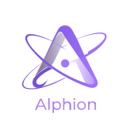

<p align="center">
  
</p>

# Alphion

Alphion 是一个面向不同软件项目、在证据和安全边界内持续优化 harness 的轻量 Agent 项目。

当前 **v0.10.0** 在 `Workspace → Project → shared Agent → Session → Goal/Run → ProviderConversationPlan → Tool` 脊柱上加入 Provider Profile v3、ref-only 图片消息、最新调用上下文占用和三端专用图片传输；保留 Project 独立凭据、Provider 实测与有界多项目 Run 保活。SQLite 使用 user_version 9。

资源优先级固定为内置 → 用户共享 → 项目 `.alphion-resources/manifest.json` → Session overrides。扩展包仅支持声明式资源，不执行第三方 JavaScript。用户资源根可通过 `ALPHION_RESOURCE_HOME` 指定，否则使用平台标准配置目录。

这是新的 0.x 能力里程碑。首次打开 v7 数据库会先 checkpoint 并创建、验证相邻 `.v7-backup`，再事务升级到 SQLite user_version 8。回滚必须停止所有 Alphion 进程、保留失败文件用于诊断、恢复 `.v7-backup` 并切回 v0.8.0；迁移后的 Project credential envelope 和 v0.9 状态不会回写到 v7。

## 当前能力

- 项目级共享 Agent 与分层 Session/Run/Turn/ToolCall；每个 Session 独立持有分支消息、双队列、运行租约、审批上下文、compaction 和 append-only AgentShape。
- 每个 Project 最多 64 个活动 Goal；Goal 拥有专属可见 Session 和 append-only revision。Agent 只能用 Evidence 推进或建议完成，根目标/验收/安全约束及最终完成确认仍由用户控制。
- 一次性、固定间隔和标准五段 Cron Schedule 使用 IANA timezone、10 分钟租约和幂等 receipt；只在活动 Project 的 Alphion 进程内扫描，忙 Session 转为持久 follow-up，重启最多补最近一次遗漏。
- 模型感知 Compaction 在有效窗口占用达到 85% 前触发，扣除输出、Tool schema 和安全余量；从原始分支重建并持久记录来源、保留项、损失和 digest，聊天只显示非历史“已优化上下文”状态。
- Provider Profile v3 可在 4K–4M 内显式覆盖模型上下文窗口并声明 vision；未知模型使用 32K。Run 累计 token 与最近一次 Provider 调用的上下文占用分开投影，真实 usage 前明确显示 `≈` 估算。
- `SessionMessageInput` 支持纯文字、纯图片或多图加文字的 send/steer/follow-up。图片以 SHA-256 内容寻址保存，SQLite/Event/Snapshot/缓存只携带经过验证的 `ImageAttachmentRef`，非 vision Provider 在消息和 Run 落盘前拒绝。
- Provider 凭据由每个 Project 的独立随机 key 加密，key 位于 SQLite 外的平台配置目录；SQLite 只保存 AES-256-GCM envelope，Provider 调用时短暂解密。密码、Device Vault 和设备凭据公共/UI 合同已删除。
- idle、已塑形 Session 可按当前 leaf 或指定 entry 原子 Fork；目标保留 Evidence、重映射 entry/Memory 引用、重新计算身份 digest，并记录不可变 provenance。
- 四层声明式资源解析、确定性 SystemPrompt Composer、任务分类与最小 HarnessPlan，以及 CodeGraph 优先、词法降级的有界代码召回。
- Node/TypeScript 优先的确定性只读 Project Profile，识别语言、运行时、模块系统、包管理器、框架、质量命令、Git/CI、约束、风险和冲突；未知项目安全降级。
- 每次运行自动注入最多 2,048 estimated tokens 的不可变 ContextPack；安全、目标、权限和强约束不会被可选画像事实挤出预算。
- 运行期 Working Memory 仅由当前任务事件 reducer 重放，跟踪阶段、轮次、工具、Evidence、错误和用量，不写入长期记忆。
- OpenAI-compatible Chat Completions 与 Responses 双协议；DeepSeek、Kimi、Qwen、GLM 提供内置大陆/国际 official endpoint，普通配置无需 Base URL，只有自定义兼容 Provider 接受 URL。
- 简体中文聊天式 Ink TUI、React/Vite loopback WebUI 和 Electron Desktop；三端使用固定底部输入框、可滚动无边框消息区、用户右/Agent 左角色布局与共享 `| / - \\` 回答标识，并完整渲染安全 Markdown/代码，reasoning 不可见。
- `read`、`grep`、`edit`、`write` 和 `shell` 工具；写入和进程执行必须逐次审批。
- SQLite 权威事件写入与 SHA-256 审计链；三端先订阅再取 snapshot，按 30/60 FPS frame 合并 delta/invalidation，慢消费者通过 cursor resync，不延迟 AgentLoop。
- ProviderConversationPlan 从当前 Run 之前的分支构建合法 user/assistant/tool 消息线；普通审计事件和 `tool.updated` 不进入 Provider 历史，当前 prompt 只追加一次。
- TUI/Web/Desktop 共用多 token 命令与补全：`/settings` 打开统一临时管理视图；`/new` 创建 Session，`/new project <目录> [--name <名称>]` 创建/复用 Project，`/open projects` 与 `/open sessions` 打开选择器；`/providers`、`/resources`、`/doctor`、`/context`、`/goals`、`/schedules` 仍可直达。命令不写入 Session history。
- TUI 支持 Ctrl+V/Alt+V 剪贴板图片和路径拖入，以 `[图片 N：name]` 安全占位；Web/Desktop 支持粘贴、拖放、缩略图与单项移除。图片失败保留按 Project/Session 隔离的文字和附件草稿。
- 进程内 LRU + SQLite L2 缓存、single-flight 合并、策略/权限/项目修订失效和可选 provider prompt caching；疑似秘密不进入缓存。
- Project 注册层保证名称/realpath 唯一、每项目独立 SQLite v9；Workspace 切换时只保活已有 Run、审批或 follow-up，暂停后台 Scheduler，空闲后自动释放 writer。
- Provider 页面支持精确指定 Profile 的“测试当前”和最多并发 2 的“一键测试全部”；测试发送真实的受限请求，不使用 routing fallback，不写 Session、Evidence 或缓存。
- WebUI 只绑定 `127.0.0.1`，采用 HttpOnly/Origin/CSRF/SSE，并以独立 20 MiB 受限 endpoint 传图片；Electron 开启 sandbox/contextIsolation、禁用 Node integration/任意导航，preload 只暴露窄 allowlisted IPC（含独立 attachment import/read）。
- `alphion-icon.svg` 是唯一图标源；确定性生成 Web favicon/PNG 和 Windows 多尺寸 ICO，Web/Desktop 左上角、Electron 窗口、安装器、开始菜单与快捷方式使用同一品牌。

本版不会实现 LAN/远程部署、多用户、跨 Project 协作、动态代码插件、SubAgent、常驻 daemon、托盘服务或操作系统计划任务。

## 安装与构建

- Node.js 22.13+
- TypeScript 5.9+
- ESM
- `better-sqlite3` 含原生 ABI；根安装树固定用于 Node，Electron 使用忽略的独立 `.desktop-runtime/`，打包前运行 `npm run desktop:deps`

```bash
npm install
npm run typecheck
npm run build
```

正式构建产物写入被忽略的 `dist/`。Windows 构建后双击 `alphion.bat` 会显示循环启动菜单，可进入工作台、运行只读诊断或查看帮助；带参数调用仍原样透传退出码，适合 CI/脚本。其他平台使用 `npm run cli --` 或 `node dist/cli/index.js`。交互界面使用：

```bash
npm run tui
# 或
alphion.bat tui
npm run desktop
# 或本地 WebUI
alphion.bat web
```

启动不要求密码或凭据解锁；首次为某 Project 导入 API key 时自动创建该 Project 的独立 key。Project key 丢失时只要求对应 Profile 重新输入，不会误判为数据库损坏，也不会自动删除旧密文。reasoning 仅在 Provider 当前 Run 的工具续轮中短暂存在，不进入任何用户界面、SQLite 或重放。

## 配置兼容服务

以下示例配置一个本机无认证自定义 Chat Completions 服务：

```bat
alphion.bat provider set --id local --preset custom-openai-compatible --base-url http://127.0.0.1:11434/v1 --model your-model --protocol chat-completions --active
alphion.bat run --prompt "读取 README 并概括当前能力"
```

需要 Bearer key 时，数据库只记录环境变量名称：

```bat
set COMPATIBLE_API_KEY=replace-me
alphion.bat provider set --id hosted --preset custom-openai-compatible --base-url https://example.com/v1 --model model-id --protocol responses --auth-env COMPATIBLE_API_KEY --active
```

常用命令：

```text
provider set/list/activate/test/test-all
policy shell allow/list/remove
cache stats/clear
doctor [--json]
project create/open/inspect [--refresh] [--json]
session create/list/show/shape/reshape/checkout/send/steer/follow-up/fork
context list/show
goal create/list/show/update/progress/confirm/archive/restore
schedule create/list/show/pause/resume/run-now/executions
resource list/doctor
desktop
web [--port PORT]
run --prompt ...
tui [--session SESSION_ID]
```

`edit`、`write` 和 `shell` 只在交互式终端逐次展示完整动作并批准；管道、CI 或其他无 TTY 场景默认拒绝。shell 还必须匹配本地白名单中的可执行文件、摘要和参数前缀。这个边界是“白名单 + 审批”的进程控制，不是操作系统级沙箱。

## 项目边界

```text
src/          模型和界面无关的领域、应用、端口与协议核心
adapters/     只读画像、OpenAI-compatible、DeepSeek、SQLite/Project 凭据、缓存、秘密和工具实现
cli/          命令行、Session/资源/shape 与一次性 run 适配器
tui/          Ink 终端界面、运行投影和逐次审批适配器
ui/           三端共享命令、事件队列与安全 Markdown AST
webui/        loopback HTTP/SSE 与 React/Vite renderer
desktop/      Electron Main、sandbox preload 与 IPC 合同
tests/        单元、合同、集成、安全与 CLI 验证
benchmarks/   通信、缓存和 SQLite 基线
```

依赖方向固定为 `CLI/UI -> application -> domain` 和 `adapters -> ports <- application`。`src/` 不能导入 adapter、CLI、TUI 或 WebUI；具体 SDK 类型不能进入核心公共接口。

## 公共接口

根入口保留稳定只读的 `ALPHION_BRAND`，并公开共享 Agent、Project/Session、Goal/Schedule、Compaction、AgentShape、HarnessPlan、ResourceResolution、SystemPromptPlan、ProviderTestService、ProjectCredentialStore、AttachmentService 与 Workspace/runtime 端口。稳定子路径包括 `alphion/runtime`、`alphion/providers`、`alphion/resources`、`alphion/webui`、`alphion/desktop` 及既有具体 adapter。Provider Profile schema v3 支持环境变量/Project 加密凭据、vision 与 context override；AgentSessionRecord schema v3 可携带 Fork provenance，Snapshot/Frame 为 schema v2，SQLite user_version 现为 9。

当当前分支接近 Profile override、模型 catalog 或 32K fallback 得到的有效 context window 时，会话按 85% 阈值并扣除输出、Tool schema 和安全余量，从原始分支重建压缩：保留最近两个交互周期（含原图 refs）及系统/目标/验收、权限/约束/revision、失败、Evidence 和未解决项，并可调用同一 Provider 生成禁用工具、`temperature: 0`、闭合 JSON schema 校验的结构化摘要；超时、非法输出或 Provider 失败会确定性回退。每次压缩形成 append-only `CompactionRecord`，但不产生 Session 消息或移动 leaf；模型 reasoning 与图片 binary 仍不进入 SQLite JSON、重放、Working Memory 或持久缓存。

## 安全和数据

- HTTPS endpoint 默认允许；HTTP 只允许 localhost/loopback。
- 每个 Project 使用独立随机 32-byte key 和 AES-256-GCM；AAD 绑定 Project/profile/secret/revision，凭据只在导入或单次 Provider 调用时短暂解密并清零临时 Buffer。
- `.git`、`.alphion`、工具生成物、依赖、构建目录和常见秘密文件不能被 Agent 文件工具读取或修改。
- 路径同时检查词法范围、真实路径与符号链接，写入使用 revision 校验和原子替换。
- 模型输出不是完成证据；工具观察生成 Evidence ID，最终答案可用 `[evidence:<id>]` 引用。
- `.alphion/`、`docs/`、Trellis 和 CodeGraph 均保持本地且不进入 Git 或 npm 包；`dist/` 不进入 Git，但会由正式构建生成并纳入 npm 打包内容。

## 品牌资产

| 用途 | 文件 |
| --- | --- |
| 主系统 Logo | `alphion-logo.svg` |
| 图标 | `alphion-icon.svg` |
| 文字标识 | `alphion-wordmark.svg` |
| Web/Desktop PNG | `assets/alphion.png` |
| Windows 多尺寸图标 | `assets/alphion.ico` |

## 许可

[Apache License 2.0](./LICENSE)
